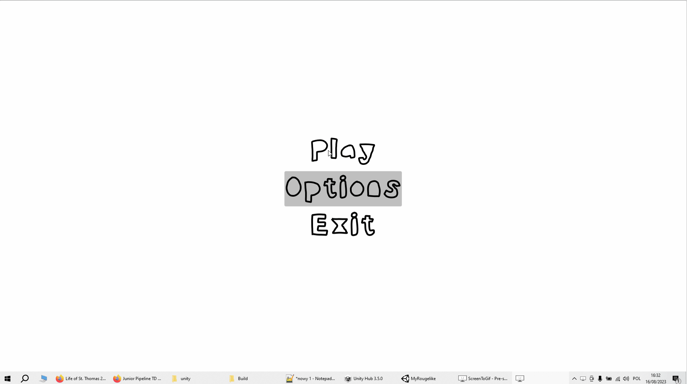
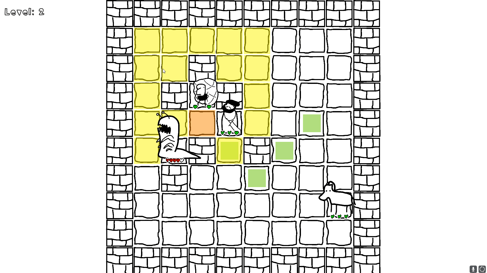

# Chess-like

Turn based tactical rouge-like. You search the dungeon.
After killing monsters on the floor you go deeper into the dungeon.
The floors are randomly generated. Every second floor is a boss fight

### Turn course:
- Declare moves on all of your pawns
- Press `space`
- All of your pawns move simultaneously
- All enemies move simultaneously

## Teams:
For now there are 3 start-teams:
- chess pieces behave like: rook, bishop and knight
- lord entourage: lord, squire and a horse:
    - Lord can perform a powerful spinning bow but will fall dawn. Cannot stand up by himself.
    - Squire is agile but cannot attack. He can pick up his lord though. Will bring attention to himself.
    - Horse can do charge, 
- Pewds: you can spawn fragile minions - you should play save until you have enough minions to attack.

## Notes on Build:
- mouse + space controls
- tutorial is bugged
- alt+f4 exit

## TO DO:
- proper menu with exit
- saving progress
- add more teams
- add more bosses
- add more enemies
- add bestiary of enemies that fills itself at encounter

### Footage of chess pieces gameplay:

### Footage of Lord Crew gameplay:
